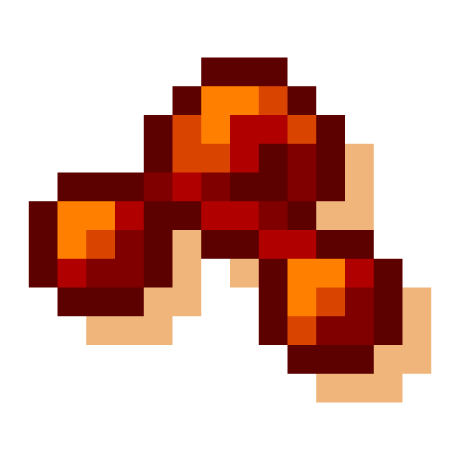

# Visuality: Reforged

## About

Visuality: Reforged is an unofficial Forge port for [Visuality](https://www.curseforge.com/minecraft/mc-mods/visuality), please support the original work.

This is a simple client-sided cosmetic mod that will add a bunch of new particles such as crystal sparkles, particles on mob hitting, custom blob particles for slimes, environmental particles to your Minecraft world.

Expect particles collection expanding with the mod updates!

## Configuration

The general client options are stored in `config/visuality/config.toml`. Particle emitters are configured by the JSON files under `config/visuality/particle_emitters/`.

Block ambient emitter entries accept either a block ID such as `minecraft:amethyst_cluster` or a block tag prefixed with `#`, such as `#c:ores/gold`.

Entity armor emitter entries likewise accept either an item ID or an item tag prefixed with `#`. Slime blob color is configured as an RGB integer with the `slime.color` option.

## Supported versions

Active maintenance is limited to the NeoForge `1.21.1` and `1.21.8` branches. All other Minecraft-version branches are end-of-life and will not receive fixes or releases.

## Feedback

All feature requests should go to [Visuality](https://github.com/PinkGoosik/visuality).

All bug reports on Forge should go to Visuality: Reforged.
